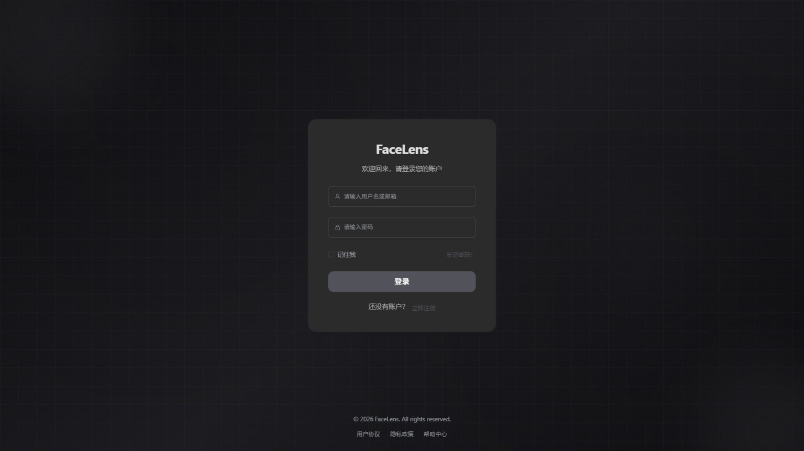
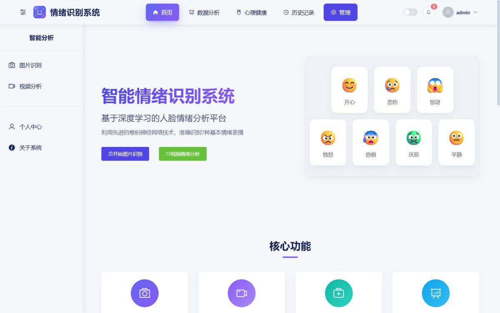
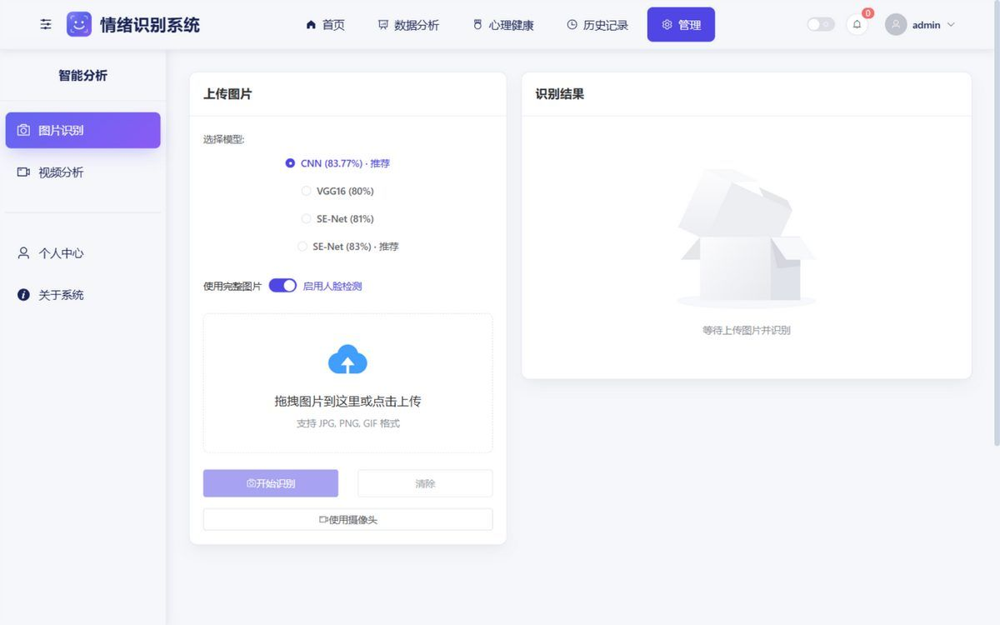
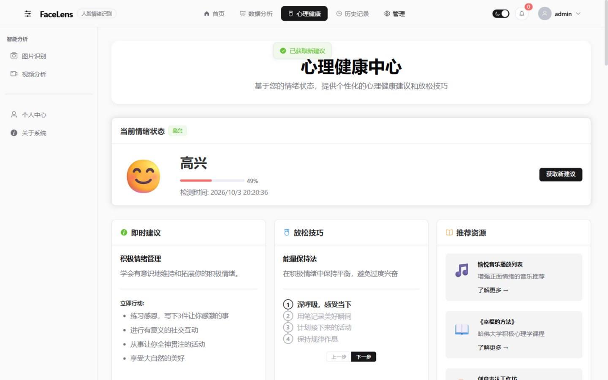
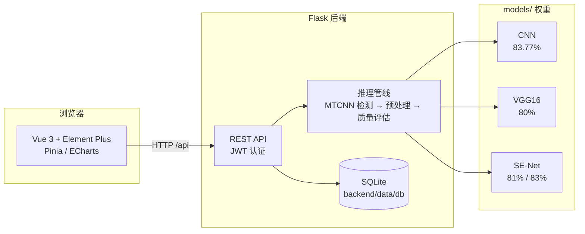

<div align="center">


**基于 RAF-DB 的端到端人脸情绪识别平台 · Facial Emotion Recognition System**

从模型训练到 Web 应用，覆盖情绪识别的完整链路

[](https://github.com/LinJJ12/FaceLens/actions/workflows/ci.yml)
[](https://github.com/LinJJ12/FaceLens/actions/workflows/docker-publish.yml)
[](https://www.python.org/)
[](https://www.tensorflow.org/)
[](https://flask.palletsprojects.com/)
[](https://vuejs.org/)
[](https://vitejs.dev/)
[](./LICENSE)

[快速开始](#-快速开始) · [Docker 部署](#-docker-部署) · [模型训练](#-模型与训练) · [API 文档](#-主要-api)

</div>

---

## 📸 系统预览

| 登录 | 首页 |
|:---:|:---:|
|  |  |
| **图片识别** | **心理健康** |
|  |  |

> 界面包含浅色 / 深色双主题，支持响应式布局。

## ✨ 功能特性

**情绪识别**

- 🖼️ **图片识别** — 单图预测，MTCNN 人脸检测、对齐与质量评估（清晰度 / 亮度 / 对比度），支持摄像头拍照
- 🎬 **视频分析** — 视频抽帧逐帧分析，输出情绪时间轴、转换记录与情绪流，支持导出 PDF 分析报告
- 🔀 **多模型切换** — CNN / VGG16 / SE-Net（81、83 两版）四套权重在线切换，准确率实时从后端读取
- ⚡ **批量预测** — 多张图片一次性提交推理

**数据与管理**

- 📊 **数据分析** — 情绪分布、趋势、置信度、24 小时时段、日历热力图等 8 类图表（ECharts）
- 🕘 **服务端历史** — 识别记录入库存储，历史记录页支持搜索/筛选/单条与批量删除
- 📄 **报告导出** — 数据分析与视频分析结果一键导出为 PDF 报告
- 🛠️ **管理后台** — 用户管理、识别历史、日记、感恩记录、健康评估的统一管理，附系统运行信息与后端日志查看
- 🔐 **JWT 认证** — 注册、登录、令牌自动刷新、资料与头像管理、修改密码

**心理健康辅助**

- 💚 **健康评估** — 基于情绪记录的心理状态参考与建议（服务端按日生成）
- 📔 **情绪日记 / 感恩记录** — 辅助情绪管理与自我调节
- 🧘 **放松训练** — 呼吸练习、冥想引导视频、PMR 渐进式肌肉放松、接地练习

> ⚠️ 系统输出仅供参考，不构成任何医学或心理诊断建议。

## 🏗️ 系统架构



**技术栈**：Vue 3 + Vite + Pinia + Element Plus + ECharts ｜ Flask + Flask-SQLAlchemy + OpenCV + Pillow ｜ TensorFlow / Keras ｜ SQLite（可通过 `DATABASE_URL` 切换）

## 🚀 快速开始

本仓库**不包含预训练模型权重**（体积大，且 RAF-DB 数据集需自行申请），因此支持三种使用深度，可按需选择：

| 模式 | 需要 `models/` | 需要后端 | 可用能力 |
|------|:---:|:---:|------|
| **A. 仅 UI 预览** | ❌ | ❌ | 浏览登录页与前端界面（无法登录） |
| **B. UI + 业务（无识别）** | ❌ | ✅ | 登录、注册、管理后台、各页面导航；识别不可用 |
| **C. 完整功能** | ✅ | ✅ | 上述全部 + 图片 / 批量 / 视频情绪识别 |

### 环境要求

- **Python 3.8** + **TensorFlow 2.10.x**（仅模式 B / C 需要）
- **Node.js 18+**（仅前端开发需要）

### 1️⃣ 克隆仓库

```bash
git clone https://github.com/LinJJ12/FaceLens.git
cd FaceLens
```

### 2️⃣ 启动后端（模式 B / C）

```bash
cd backend
python -m venv .venv
# Windows
.venv\Scripts\activate
# Linux / macOS
source .venv/bin/activate

pip install -r requirements.txt
pip install "tensorflow==2.10.1"
python main.py
```

后端运行在 `http://localhost:5000`。首次启动会自动创建 SQLite 数据库并写入演示账号：

| 账号 | 密码 | 角色 |
|------|------|------|
| `admin` | `admin123` | 管理员 |
| `test` | `test123` | 普通用户 |

> 无权重时后端同样可以启动：模型预热阶段会跳过缺失文件，`/api/models` 显示各模型 `available: false`，识别接口不可用，其余功能正常。

### 3️⃣ 启动前端

```bash
cd frontend
npm install
npm run dev
```

浏览器打开 `http://localhost:3000` 即可使用（开发服务器已将 `/api` 代理至后端）。

### 4️⃣ 训练模型（解锁模式 C）

按 [training/README.md](training/README.md) 完成 RAF-DB 训练并导出权重到 `models/`，重启后端后访问 `/api/models` 确认 `available: true`。仅放置 `RAF_CNN_83_best_model.h5` 即可体验单图识别。

## 🐳 Docker 部署

无需本地安装 Python / Node，一键启动前后端：

```bash
git clone https://github.com/LinJJ12/FaceLens.git
cd FaceLens

cp .env.example .env       # 编辑 .env，设置 JWT_SECRET_KEY
docker compose up -d --build
```

访问 **http://localhost:8080**（模型权重可选：`models/` 为空时仍可启动并使用除识别外的全部功能）。

| 服务 | 说明 | 端口 |
|------|------|------|
| `frontend` | Nginx 托管 Vue 静态页，`/api` 反向代理至后端 | 8080 → 80 |
| `backend` | Python 3.8 + TensorFlow 2.10.1 + Gunicorn | 内部 5000 |

常用命令：

```bash
docker compose ps          # 查看状态
docker compose logs -f     # 查看日志
docker compose down        # 停止并移除容器
docker compose down -v     # 同时删除数据卷（清空用户数据）
```

> 首次启动会预热模型，可能需要 1–3 分钟；数据持久化在 Docker 卷 `backend-data`，模型目录 `./models` 以只读方式挂载。

## 🔧 环境变量

| 变量 | 说明 |
|------|------|
| `JWT_SECRET_KEY` | JWT 签名密钥。**部署前必须设置为强随机密钥** |
| `DATABASE_URL` | 可选。默认 `backend/data/db/emotion_recognition.db` |

## 📡 主要 API

| 方法 | 路径 | 说明 |
|------|------|------|
| `GET` | `/api/health` | 服务健康检查 |
| `GET` | `/api/models` | 模型加载状态与准确率 |
| `POST` | `/api/auth/login` | 登录获取 JWT |
| `PUT` | `/api/auth/profile` | 更新资料（邮箱 / 头像路径） |
| `POST` | `/api/auth/avatar` | 上传头像（base64） |
| `GET` | `/api/auth/stats` | 个人使用统计（真实数据） |
| `POST` | `/api/predict` | 单图情绪识别 |
| `POST` | `/api/batch_predict` | 批量识别 |
| `POST` | `/api/video/upload` | 上传视频 |
| `POST` | `/api/video/analyze` | 视频情绪分析 |
| `GET` | `/api/histories` | 查询识别历史（分页） |
| `GET` | `/api/health/assessment` | 当日心理健康评估 |
| `GET` | `/api/admin/system-info` | 系统运行信息（管理员） |
| `GET` | `/api/admin/system-logs` | 后端日志尾部（管理员） |

调用识别等受保护接口时需携带 `Authorization: Bearer <token>`：

```bash
curl -X POST http://localhost:5000/api/predict \
  -H "Content-Type: application/json" \
  -H "Authorization: Bearer <token>" \
  -d "{\"image\":\"data:image/jpeg;base64,...\",\"model\":\"cnn\",\"detect_face\":true}"
```

## 🧠 模型与训练

| 模型 | 测试集准确率 | 键名 | 特点 |
|------|:---:|------|------|
| CNN | **83.77%** | `cnn` | 经典卷积网络，速度与精度均衡 |
| VGG16 | 80% | `vgg` | 深层结构，特征提取能力强 |
| SE-Net | 81% | `se81` | 通道注意力机制 |
| SE-Net | **83%** | `se83` | 优化版 SE 网络，效果最佳 |

权重文件名约定见 `backend/src/config/settings.py` 中的 `MODEL_PATHS`。训练流程（数据准备 → Notebook → 导出）详见 [training/README.md](training/README.md)，对应 Notebook 位于 `training/notebooks/`（CNN / VGG / SE）。

## 📁 目录结构

```text
.
├── backend/                 # Flask API
│   ├── main.py              # 启动入口
│   ├── src/                 # api / auth / config / ml / storage
│   ├── scripts/             # 数据库迁移与运维脚本
│   ├── tests/
│   └── data/                # 运行时数据（uploads / logs / db，默认忽略）
├── frontend/                # Vue 3 前端
│   ├── public/              # Favicon 等静态资源
│   └── src/                 # pages / api / assets / stores / router
├── training/                # RAF-DB 训练 Notebook 与说明
├── models/                  # 模型权重（大文件，默认忽略）
├── docs/                    # Banner、截图等文档资源
├── docker-compose.yml       # Docker 一键部署
└── .env.example             # 环境变量模板
```

详细约定见 [docs/directory-structure.md](docs/directory-structure.md)，后端说明见 [backend/README.md](backend/README.md)。

## 🔒 安全与隐私

- 上传图片 / 视频仅保存在本地 `backend/data/`；请勿将含真实用户数据的数据库、日志或上传目录提交到公开仓库。
- 公网或共享环境部署前，务必配置强随机 `JWT_SECRET_KEY`，并修改或禁用演示账号与弱口令。
- 请勿在 Issue、截图或提交内容中粘贴个人身份信息、密钥或生产凭据。

## 🧪 测试与 CI/CD

后端测试不依赖 TensorFlow 与模型权重（缺失时自动注入桩模块并跳过模型用例）：

```bash
cd backend
pip install -r requirements.txt -r requirements-dev.txt
python -m pytest tests/ -v
```

GitHub Actions（`.github/workflows/`）提供：

| 工作流 | 触发 | 内容 |
|--------|------|------|
| `CI` | push / PR 到 main | 后端 ruff + pytest（Python 3.8 / 3.10 矩阵）、前端构建（Node 18 / 20）、Docker 镜像构建验证 |
| `Docker Publish` | push main / 打 `v*` 标签 | 前后端镜像发布到 GitHub Container Registry（`ghcr.io`） |
| Dependabot | 每周 | pip / npm / docker / actions 依赖更新检查 |

## 🤝 贡献

欢迎通过 Issue 反馈问题或提交 Pull Request。提交前请确保：

- 代码风格与项目现有风格一致
- 新功能附带必要的说明或测试
- 不引入真实用户隐私数据

## 📄 许可证

本项目采用 [CC BY-NC 4.0](LICENSE) 协议发布——**仅供学习、研究与个人技术交流，禁止商业用途**（含出售、商业部署、收费服务）。复用时请保留署名。

## 🙏 致谢

- [RAF-DB](http://www.whdeng.cn/RAF/model1.html) — Real-world Affective Faces 数据集及相关研究工作
- [TensorFlow](https://www.tensorflow.org/) / [Keras](https://keras.io/)、[Flask](https://flask.palletsprojects.com/)、[Vue.js](https://vuejs.org/)、[Element Plus](https://element-plus.org/) 等优秀开源项目

---

<div align="center">

如果这个项目对你有帮助，欢迎点一个 ⭐ 支持一下

</div>
